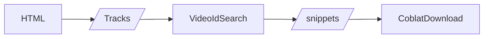

# Spotify Playlist Music Downloader
this web application has input of HTML which is Spotify Playlist page, as while the output is behavior of downloading. It needs to operate with your google cloud console's Youtube Data V3 API key.

### Learn about Using it
first, prepare your own Google Cloud Console Key and spotify playlist page's HTML to download.
1. input your HTML
2. collect with your key
3. inspect the result of collecting on track list section. Each track has the snippets to choose by user; they show their title on youtube.
4. click download button and wait to complete

### about more...

this app uses `coblat` to get download links, which is collected based on youtube videoIds. the videoIds come from Youtube Data V3 API and to use that it parses and extracts tracks' info from HTML you given.